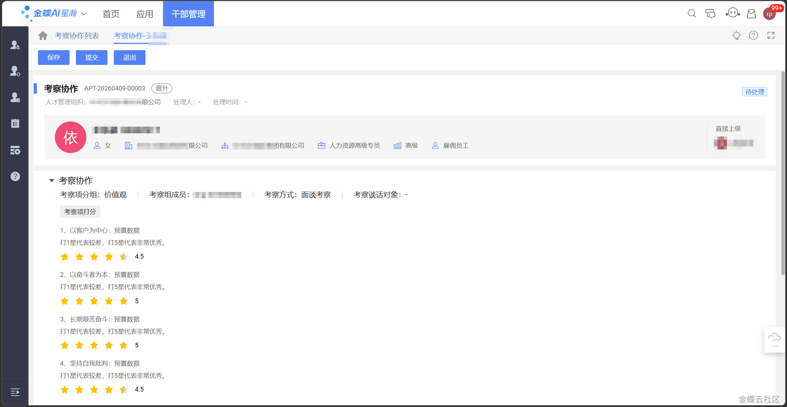

## 考察协作

## 1 功能介绍

考察协作是干部考察环节的协作任务模块，用于考察组成员对拟任命员工进行考察评价并反馈意见。

本模块支持多名考察组成员并行处理考察协作任务，共同完成考察评价工作。

## 2 应用场景

-   多人考察：多名考察组成员共同参与考察
    
-   分组考察：不同考察小组分别进行考察评价
    

## 3 系统路径

人才发展云 > 干部管理 > 干部任免管理 > 考察 > 考察协作

## 4 主要操作

## 4.1 考察协作任务处理

### 4.1.1 前提条件

已启动相关考察协作任务。

### 4.1.2 操作步骤

1.  当启动了考察协作后，考察组成员可通过平台消息中心的相关通知消息进入协作详情页，也可通过考察协作列表找到相关单据后进入协作详情页；
    
2.  在考察协作详情页中，可录入考察评价信息；
    
3.  点击保存按钮，将保存已录入的考察评价信息，考察协作仍可编辑；点击提交按钮，则考察评价信息提交至考察节点处理人，考察协作仅可查看。
    

### 4.1.3 注意事项

**若该考察组有多名考察组成员，则多名成员可并行处理该考察协作任务，且任一成员提交考察协作单则可结束任务。**

## 5 常见问题

**Q：**考察协作任务如何接收？

**A：**考察组成员可通过平台消息中心的通知消息进入协作详情页。

**Q：**多名考察组成员如何协作？

**A：**多名成员可并行处理考察协作任务，任一成员提交即可结束任务。

**Q：**考察评价提交后还能修改吗？

**A：**提交后考察协作仅可查看，不可再编辑。如需修改请联系考察节点处理人。

## 变更记录

|**版本**|**日期**|**变更内容**|
|---|---|---|
|V8.0.9|2026-05-09|初始版本|
