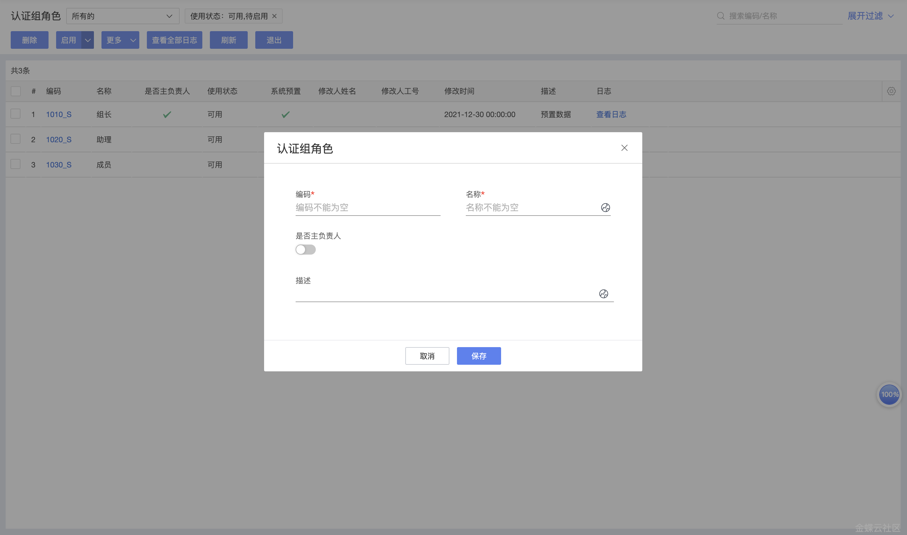
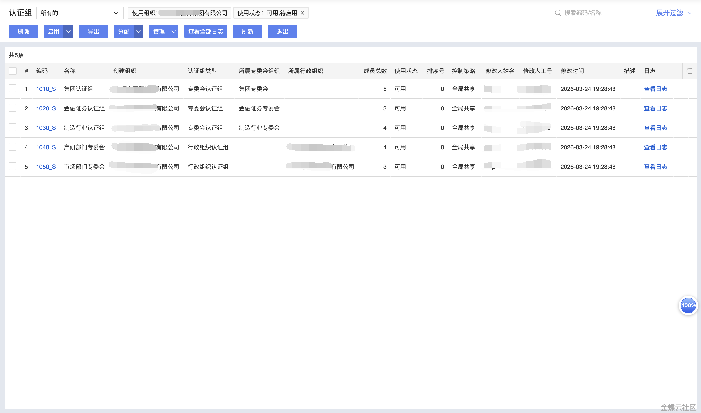
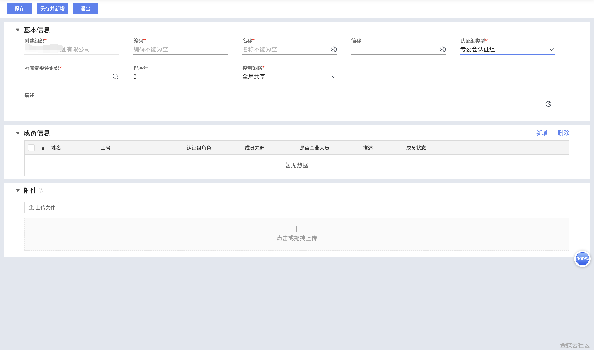
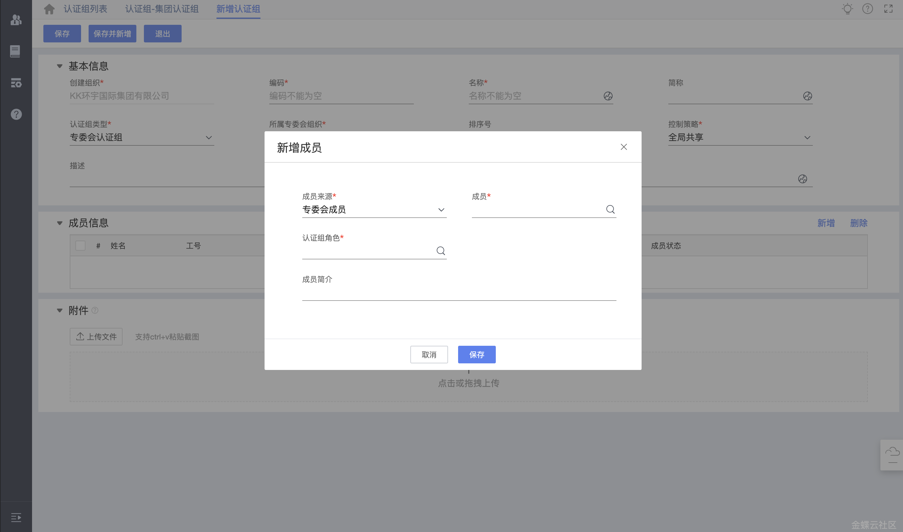

## 认证组

## **1 功能介绍**

支持按行政组织或专委会组织管理维度，创建并维护认证组、维护认证组成员。

## **2 应用场景**

在专业委员会下创建认证组和认证组成员，从而服务于任职资格认证、职级评定等多个业务的考核场景。

## **3 系统路径**

人才发展云>人才发展基础服务>基础配置>认证组角色

人才发展云>人才发展基础服务>专业委员会>认证组

## **4 主要操作**

4.1 新增认证组角色

4.1.1 关键字段说明

|**字段名称**|**详细解释**|
|---|---|
|是否主负责人|是否该认证组的负责人，比如组长等等|

4.1.2 操作校验说明

-   成立日期不能晚于生效日期；
    
-   生效日期不能早于上级专委会组织的最早生效日期，也不能早于本组织的成立日期。
    

4.2 新增认证组

4.2.1 关键字段说明

|**字段名称**|**详细解释**|
|---|---|
|认证组类型|专委会认证组：归属于专委会组织，一般由该领域资深专家组成，用于任职资格专业能力评审等。行政组织认证组：归属于行政组织，一般由业务管理者组成，基于任职资格认证结果、结合业务需求做出岗位聘用等。|

4.3 新增认证组成员

4.3.1 关键字段说明

|**字段名称**|**详细解释**|
|---|---|
|成员来源|专委会成员：认证组成员来源于专委会成员。其他人员：认证组成员来源于企业内部其他人员。|

___

## **变更记录**

|**产品版本**|**更新内容**|**更新时间**|
|---|---|---|
|V8.0.4|初始版本|2026年3月|

## 相关条目

- [人才发展基础服务整体介绍](feature-talent-dev-foundation.md)
- [专委会架构与专委会组织](feature-committee-architecture.md)
- [专委会角色与专委会成员](feature-committee-roles.md)
