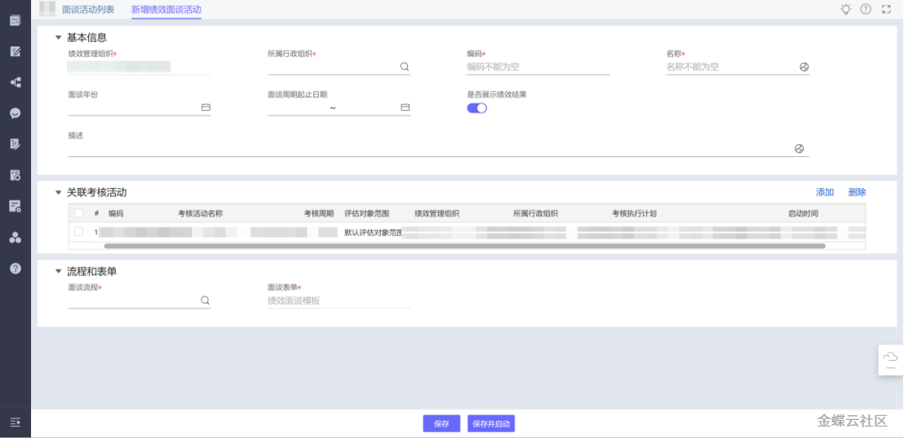
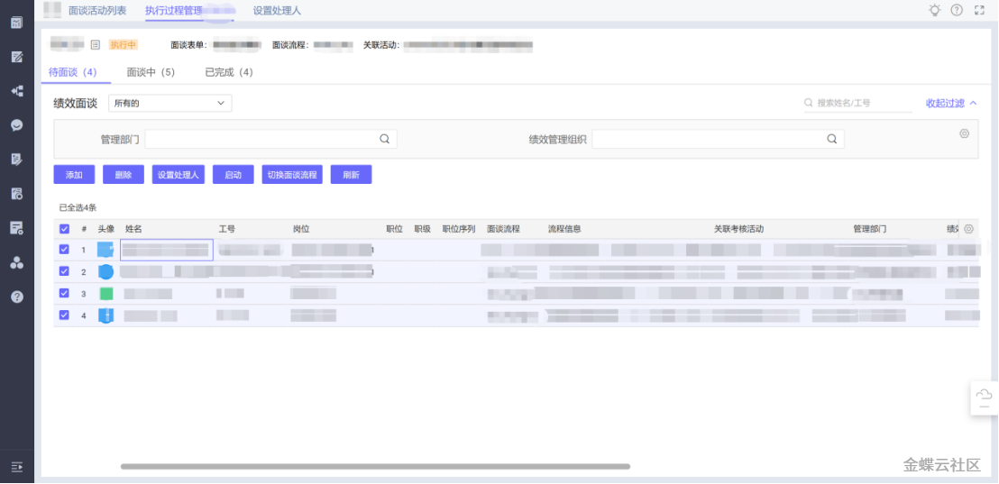
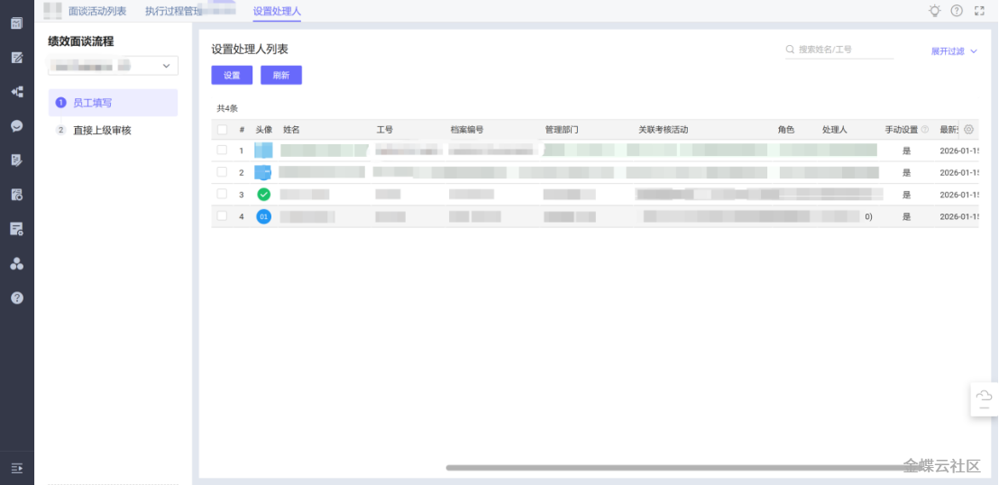
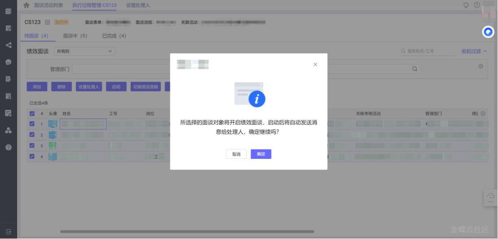
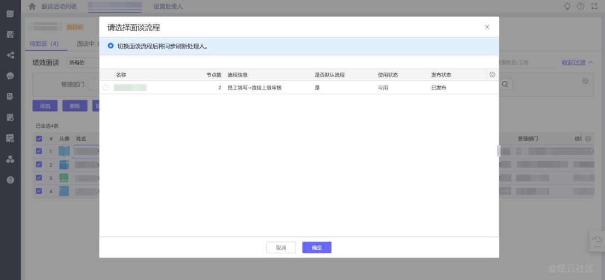
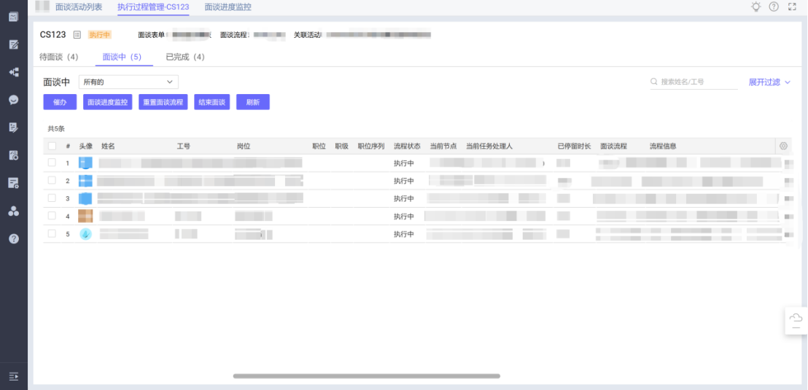
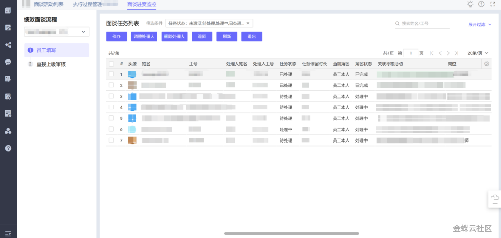
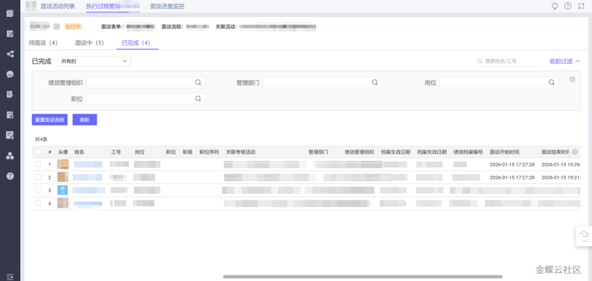
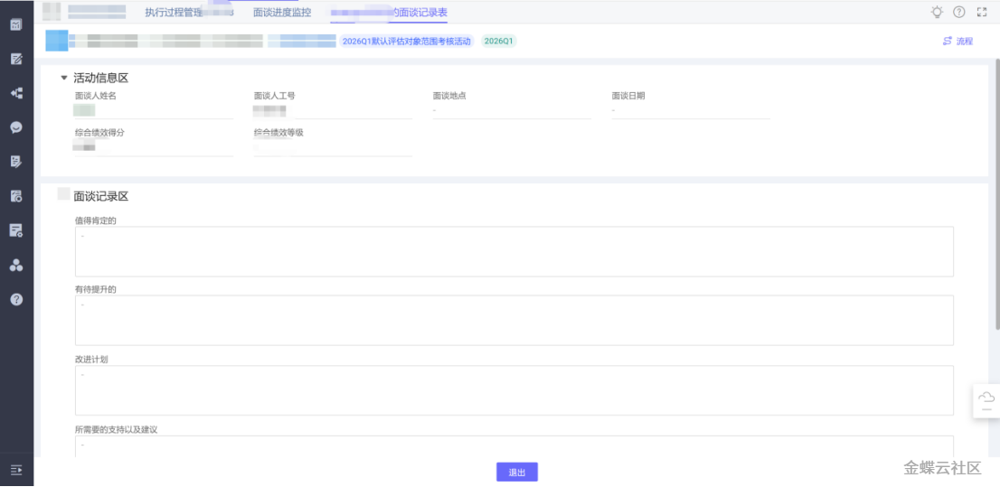

## **1 功能介绍**

绩效面谈管理是绩效考核全流程中衔接绩效结果确认与绩效结果应用的核心环节，涵盖绩效面谈活动的创建、处理人配置、单/批量启动、流程监控等全业务流程的规则配置与操作管理。该功能支持关联绩效考核活动以自动获取面谈对象，可实现绩效面谈的批量标准化启动与个体灵活发起，同时提供面谈流程的实时监控、催办、处理人调整等管控能力，完成面谈全流程的记录与管理，为员工绩效改进、后续调薪晋升等人力资源决策提供面谈结论依据。

## **2 应用场景**

各企业的绩效考核类型（如年度/季度常规考核、专项考核、临时补充考核等）不同，对应的绩效面谈管理要求与流程也存在差异；企业在完成线上绩效考核结果确认后，可在绩效面谈管理中针对不同考核类型的要求，灵活开展单/批量绩效面谈工作，满足标准化管控与个性化操作的双重需求。

1）大批量面谈：

在全公司年度考核、全部门季度考核等集中考核完成后，开展全员或全部门的绩效面谈。企业在开展大批量绩效面谈时，HR部门往往会提出标准化的管控要求，如关联对应考核活动批量获取面谈对象、统一配置面谈流程处理人、批量启动面谈任务、对未完成面谈的对象统一催办等；在绩效面谈管理中按照此类管控要求进行配置并执行操作即可。

2）个体/小范围面谈：

员工专项考核、临时补充考核、个别员工绩效改进指导、绩效异议处理后的单独面谈等情况中，企业对个体或小范围的绩效面谈要求更灵活；HR或直接主管可根据考核结果及员工实际情况，单独为目标员工发起绩效面谈，无需遵循标准化批量流程，可直接在绩效面谈管理中精准定位对象、快速配置处理人并启动面谈，同时可实时跟进单个面谈的流程进度。

## **3 系统路径**

【目标绩效云】→【个人绩效考核】→【绩效面谈活动管理】→【面谈活动详情】

## **4 主要操作**

### 4.1 操作步骤

列表操作：在面谈活动列表页可进行面谈活动的新增、删除、启动、结束等操作，支持按面谈活动编码/名称、绩效管理组织、面谈状态等维度筛选；点击对应面谈活动名称，进入面谈活动详情页，页面按面谈进度分为“待面谈”“面谈中”“已完成”三个核心页签，支持单/批量开展面谈全流程操作。

详情页核心操作流程：

##### 4.1.1 新增绩效面谈活动（关联考核活动）

1\. 在面谈活动列表页点击「新增」按钮，进入【新增绩效面谈活动】页面，填写必填项：绩效管理组织、所属行政组织、编码、名称、面谈年份、面谈周期、起止日期等基本信息；

2\. 选择关联考核活动，系统将获取该考核活动中参与的被考核人员，并将其作为本次面谈活动的面谈对象；

3\. 配置面谈流程与面谈表，选择是否展示绩效结果（供面谈双方参考），并填写面谈活动描述；

4\. 信息配置完成后，可选择「保存」（暂不启动）或「保存并启动」（直接发起面谈）。

##### 4.1.2 配置面谈处理人（单/批量）

1\. 进入面谈活动详情页的「待面谈」页签，点击「设置处理人」按钮，进入设置页面；

2\. 可全选、批量勾选或单独选择面谈对象，为面谈流程各节点（如员工填写、直接上级审核等）配置处理人；系统默认员工本人为填写节点处理人，支持手动调整；

3\. 处理人配置完成后，确认并保存，完成面谈流程的人员权限设置。

##### 4.1.3 启动绩效面谈（单/批量）

1\. 批量启动：在「待面谈」页签中全选或批量勾选目标面谈对象，点击启动按钮，系统通过任务中心向各节点处理人发送面谈待办任务，也支持根据不同的需求切换所需的绩效面谈流程；

2\. 单个启动：在「待面谈」页签中精准定位单个面谈对象，勾选后点击启动按钮，单独向该对象的流程处理人发送待办任务；

3\. 启动后，面谈对象的状态将从“待面谈”流转至“面谈中”。

##### 4.1.4 面谈流程监控与异常处理

1\. 进入面谈活动详情页的「面谈中」页签，实时查看面谈进度，包括当前节点、任务处理人、面谈开始时间、已停留时长及流程状态等核心信息；

2\. 点击「面谈进度监控」按钮，可针对不同情况执行管控操作：

(1) 批量或单个催办：对停留时长过久、未及时处理的面谈任务，发起催办通知，提醒处理人完成操作；

(2) 调整处理人：因人事调动、岗位调整等原因，修改面谈流程各节点的处理人，保障流程继续推进；

(3) 删除面谈任务：对无需参与面谈的对象，删除其面谈任务，终止该对象的面谈流程；

(4) 重置面谈流程：对流程异常的面谈任务，重置后重新启动，使其恢复正常流程；

(5) 点击「结束面谈」，可对已完成面谈且无需后续操作的任务手动终止流程，使其状态流转至「已完成」。

##### 4.1.5 面谈结果查看

1\. 进入面谈活动详情页的「已完成」页签，查看所有已完成面谈的对象信息，包括面谈完成时间、最终面谈结论、流程节点完成记录等；

2\. 进入对应员工的面谈详情页，展示面谈全流程数据及面谈表填写内容，支持后续查询与统计，为绩效改进和人力决策提供依据。

### 4.2 操作应用场景

##### 场景一：企业完成全公司年度考核后，需批量启动全员绩效面谈，实现标准化流程管控

|操作步骤|操作说明|
|---|---|
|步骤一|1\. 在面谈活动列表页点击「新增」，维护基本信息后，选择关联年度考核活动，系统获取全员面谈对象；配置统一的面谈流程（员工填写→直接上级审核）与面谈表，并开启「展示绩效结果」开关。|
|步骤二|2\. 进入「待面谈」页签，点击「设置处理人」，全选所有面谈对象，确认系统默认的处理人配置（员工本人+直接上级），无需手动调整；全选所有待面谈对象，点击「启动」，批量向全员发送面谈待办任务。|
|步骤三|3\. 进入「面谈中」页签，实时监控全员面谈进度，筛选出「已停留时长超期」的面谈任务，批量点击「催办」发起通知；对因人事调动需调整处理人的对象，单独点击「面谈进度监控」，修改处理人后保存即可。|
|步骤四|4\. 待全员面谈任务完成后，在「已完成」页签核对面谈整体完成情况，点击「结束面谈」，完成本次年度绩效面谈活动的整体归档。|

##### 场景二：企业完成个别员工专项考核后，需单独为其发起绩效面谈，灵活推进流程

|操作步骤|操作说明|
|---|---|
|步骤一|1\. 在面谈活动列表页点击「新增」，维护基本信息后，选择关联该员工专项考核活动，系统仅获取该员工为面谈对象，配置个性化面谈流程，根据需求选择是否展示绩效结果，并保存面谈活动。|
|步骤二|2\. 进入「待面谈」页签，定位该员工，点击「设置处理人」，确认/调整面谈流程处理人（如直属领导+部门负责人），勾选该员工，点击「启动」，单独向对应处理人发送面谈待办任务。|
|步骤三|3\. 进入「面谈中」页签，实时跟进该员工的面谈进度，若节点处理人未及时操作，单独发起「催办」；面谈过程中若需调整流程，点击「面谈进度监控」，执行重置流程/修改节点等操作。|
|步骤四|4\. 待该员工面谈任务完成后，在「已完成」页签查看面谈结论与流程记录，完成单个面谈的归档。|

## **5 变更记录**

|**产品版本**|**更新内容**|**更新时间**|
|---|---|---|
|V8.0.4|初始版本|2026年03月|