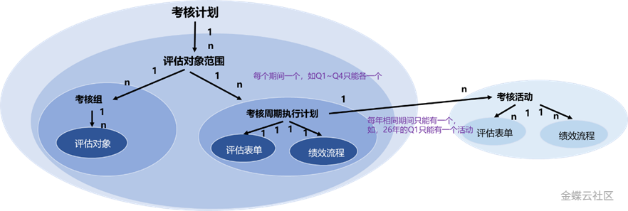

## 考核计划的整体介绍

## 1 业务背景

企业绩效管理中，绩效制度整体明确了绩效考核的完整框架，通常可从这几个维度分解：人群、指标构成结构、绩效业务流程、考核周期。不同人群所使用的表单结构、绩效流程、考核周期不同。

考核以绩效制度为框架蓝图，依照绩效制度梳理并确定不同人群未来采用不同的表单结构和绩效流程，按照固定的周期频率进行考核管理。

## 2 产品方案介绍

考核计划是绩效制度在系统上的呈现，旨在以一套标准的系统化业务语言将企业绩效制度进行拆解，并以计划形式呈现，以期实现未来的考核按照既定的考核计划无偏差执行。

为了配置一个贴近真实业务场景的示例，我们使用下列表格，并明确以下维度信息：

|**群体**|**考核周期**|**指标结构**|**绩效流程**|**评估对象**|
|---|---|---|---|---|
|部门负责人|年度|组织目标+年度重点工作任务+民主测评|指标制定->绩效评价->绩效校准|员工a，员工b|
|员工|季度+年度|个人目标+年度重点工作任务|指标制定->绩效评估->绩效校准->结果确认->绩效面谈|员工c，员工d|

**评估对象范围：**评估对象范围就是群体，我们是以“考核周期”+“指标结构”+“绩效流程”3个维度因素组合来划分群体，三个维度均一致时群体我们定义为评估对象范围。因此上表格可以划分出“部门负责人”和“员工”2个评估对象范围。

**考核周期：**考核频率或考核的频率的组合。通常会出现不同周期组合考核，如季度和年度均需要考核。

**评估表单：**通常是指评估表单结构，业务上通常理解为考核表分几大区块。一般不同区块业务属性不同：区域权重、区域中指标的字段属性等，如：目标、年度重点工作通常分为2块。因此上表格中，“部门负责人”和“员工”的表单是不同的。

**绩效流程：**这里的绩效流程指的是业务流程，由业务活动和业务活动顺序构成。如：指标制定是一个业务活动，至于如何完成指标制定，方式不限，可以由BP代为导入，也可以通过工作流（诸如，员工制定->审批->员工确认）等。因此，上表格中“部门负责人”和“员工”的绩效流程是不同的。

**考核周期执行计划：**为评估对象范围建立未来各考核周期的考核执行计划，该执行计划确定了评估对象范围在该周期上使用那个评估表单和绩效流程。如上表，可以为“员工”建立1个年度、4个季度的考核周期执行计划，这些计划使用的表单结构为“组织目标+年度重点工作任务”，绩效流程为“指标制定->绩效评估->绩效校准->结果确认->绩效面谈”。

**（考核计划）评估对象：**员工归属哪个评估对象范围以及预计从哪个周期开始参与考核。对应考核周期发起考核时，这部分评估对象可自动加入考核。如上表，员工a、员工b属于“部门负责人”，员工c、员工d属于“员工”。

**考核计划：**考核计划的建立需根据管理范围和习惯综合判断，如上表，在“部门负责人”和“员工”的考核完全由不同人员负责管理的情形下，可“部门负责人”和“员工”各建立一个考核计划。

至此，我们基于绩效制度的拆解建立了考核计划，在考核计划中为每个评估对象范围建立了符合其绩效制度要求的考核周期执行计划，明确了每个周期所使用的评估表单和绩效流程。后续考核将依据这些考核周期执行计划启动。

## 3 术语/功能介绍

**3.1** **术语/功能总体介绍**

|**术语/功能**|**说明**|
|---|---|
|考核计划|考核计划是对考核制度落地的规划，其明确了某个「主体」（绩效管理组织）在某个「考核类型」（如，常规考核）按某种「周期类型」（如，季度）开展绩效考核。|
|评估对象范围|评估对象范围是评估对象的聚合，是指在绩效考核制度下具有相同考核周期且各考核周期的考核规则（绩效评估表单、绩效流程）均一致的评估对象人群。|
|考核周期执行计划|考核执行计划是对被考核对象的考核活动安排，其明确了某个「评估对象范围」（如，干部）在某一「期间标识」 （如，Q1）上使用具体的「绩效流程」和「评估表单模板」进行考核。|
|考核活动|考核活动是对「考核周期执行计划」（如，中层管理者管理2026Q1考核计划 ）的具体执行，其定义了在具体的「考核周期」上（如，2026Q1） 对具体的「评估对象」按照特定「绩效流程」由考核活动执行所涉及的各角色协同完成考核并产生该周期的考核结果。|

**3.2** **配置总体介绍**

|**配置类型**|**配置说明**|**是否必须**|**配置序号**|
|---|---|---|---|
|前置相关配置|完成评估表单、绩效流程等相关配置|是|1|
|评估对象范围|配置考核计划所需纳入的评估对象范围|是|2|
|评估对象|归属评估对象范围的评估对象|否|3|
|考核周期执行计划|配置评估对象范围再各期间上的考核周期执行计划|是|4|

___

## 5 变更记录

|**产品版本**|**更新内容**|**更新时间**|
|---|---|---|
|V8.0.9|初始版本|2026年3月|
||