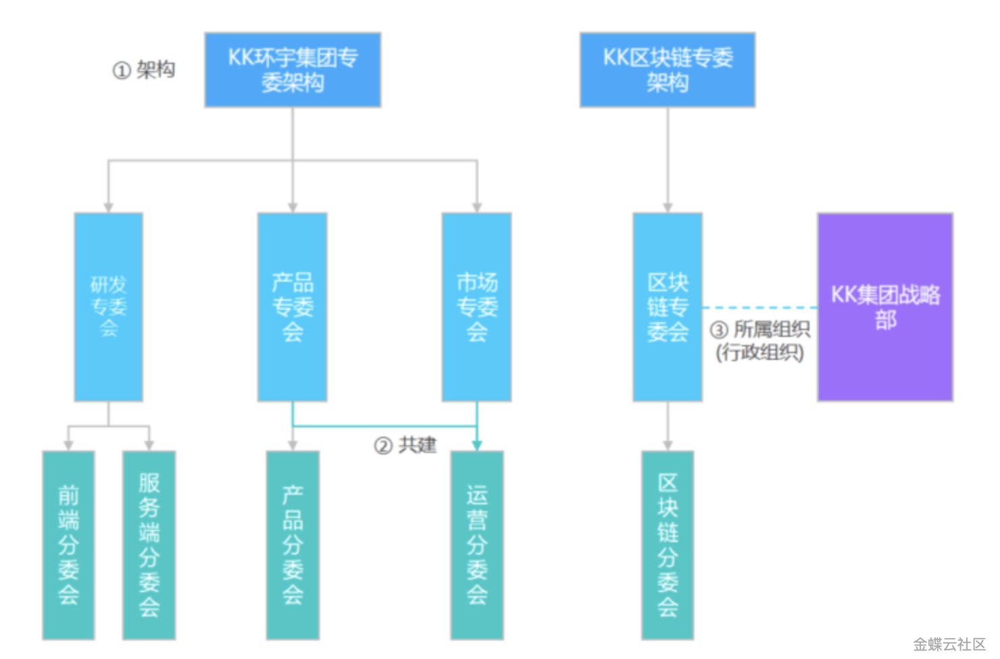

## 人才发展基础服务整体介绍

## **1 业务背景及需求描述**

**1.1业务背景**

在企业进行人才管理的过程中，通常会有独立的组织、标准、流程制度去支撑人才评估、识别和发展的全业务场景，例如：

-   建立规范的能力标准去定义人才；
    
-   建立专业委员会，保障任职资格标准的建立；
    
-   建立认证组，保障任职资格认证流程的规范。
    

**1.2需求描述**

-   专委会组织：支撑企业按职位体系方案、国家地区、区域等维度，对专委会架构、组织、角色以及成员进行管理和维护，提供专业组织保障，支撑人才决策；
    
-   认证组：支持按行政组织或专委会组织管理维度，创建并维护认证组、认证组角色和认证组成员，从而服务于任职资格认证、职级评定等多个业务的考核场景；
    
-   能力词典（能力素质维度、能力素质项、能力等级方案）：将企业整体业务目标、人才发展战略转化为个体可识别、可管理的体系化能力素质标准，支持能力素质维度、能力素质项和能力等级方案配置，实现全方位的能力描述；
    
-   能力素质库：支持企业根据业务特点和人才需求，基于多个能力素质项构建不同的能力组合，为多业务场景下能力标准的建立提供服务；
    

## **2 产品解决方案**

人才发展基础服务承载人才发展领域的专委会组织管理、能力素质管理、公共基础数据、系统配置等功能，为人才发展领域提供整体性的基础数据服务。

## **3 术语/功能介绍**

**3.1术语/功能总体介绍**

|**术语/功能**|**说明**|
|---|---|
|专委会架构|支持多业态企业独立维护、运营其专业委员会体系，支撑企业任职资格认证管理政策、标准和流程制定。|
|专委会组织|在专委会架构下，建立分类分层的专委会/分委会组织，并进行专委会组织成员信息的维护，包括系统内人员信息同步和系统外成员的信息管理。|
|认证组|支持基于专委会构建分层级的认证组，同时支持企业按照行政组织管理维度完成认证组的搭建。|
|专委会角色|可基于专委会的分工，进行相应的专委会成员角色维护，如专委会主席、秘书等，系统提供标准预置角色。|
|专委会组织类型|可维护专委会组织类型，提供专委会、分委会、专业组标准预置类型，为专委会组织构建树形层级结构提供支撑。|
|认证组角色|可基于认证组的分工，进行相应的认证组成员角色维护，如组长、成员等，系统提供标准预置角色。|
|能力素质库|可支持企业按照多业务场景下（例如任职资格标准、职级评定标准等）的能力标准诉求，提供能力标准库的建立和接口服务。通用类型：可按行政组织维度细分管理；专业类型：可按企业职位/岗位分类维度细分管理；管理类型：可按企业国家地区、行政组织、人群分类等维度细分管理；查询服务：为金蝶AI HR全领域多业务场景提供员工能力查询接口。|
|能力素质维度|可按能力模型定义能力分类，从而对能力素质项进行分组归类。|
|能力素质项|支持按不同方式对能力素质项进行详细定义：等级描述：支持对能力素质项划分评估等级，定义不同等级下的名称、关键词与描述；行为描述：支持定义能力素质项包含的行为，确认能力项的行为特征、行为关键点等。|
|能力等级方案|可按照业务对于能力素质项的等级划分要求，定义标准化的等级方案，为能力素质项的配置提供等级划分基础。|

**3.2配置总体介绍**

|**配置类型**|**配置说明**|**配置序号**|
|---|---|---|
|专委会基础配置|配置专委会组织类型、专委会角色、认证组角色|1|
|专委会架构配置|配置专委会架构|2|
|专委会组织配置|配置专委会组织|3|
|认证组配置|配置认证组及其成员|4|
|能力等级方案配置|配置能力等级方案|5|
|能力素质维度配置|配置能力素质维度|6|
|能力素质项|配置能力素质项|7|

___

## **变更记录**

|**产品版本**|**更新内容**|**更新时间**|
|---|---|---|
|V8.0.4|初始版本|2026年3月|

## 相关条目

- [专委会架构与专委会组织](feature-committee-architecture.md)
- [专委会角色与专委会成员](feature-committee-roles.md)
- [能力素质管理](feature-competency-management.md)
- [认证组](feature-certification-group.md)
